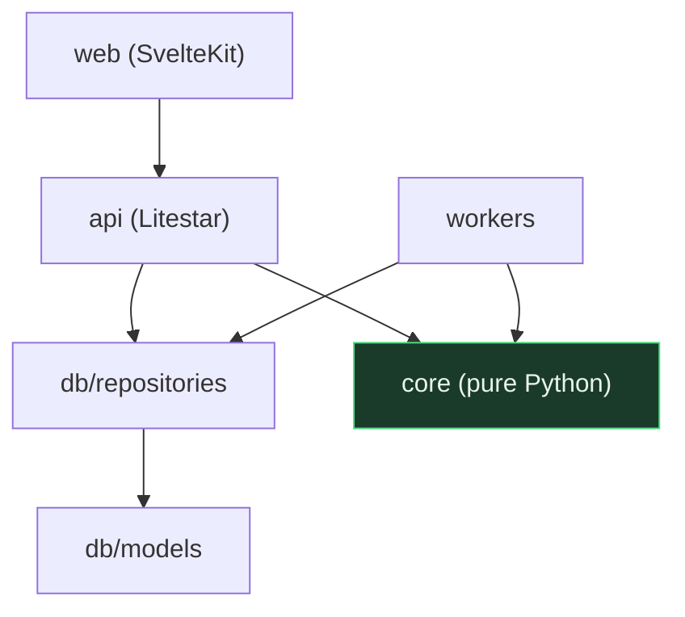

## 4. Repository layout

The most important structural rule in this document:

> **`core/` has zero framework dependencies.** No Streamlit, no Litestar, no database driver.
> It is a pure library of quant functions over dataframes and plain types.

That single rule is what makes everything above swappable, and it is what lets the 852
existing tests keep passing while everything around them changes.

```
cashflow-trader/
  core/                     # the current modules/, minus all Streamlit
    asymmetry.py            #   convexity, EV, skewed Kelly, base rates
    options.py              #   Black-Scholes, greeks, GEX, Monte Carlo
    ta.py                   #   indicators, regime
    validated_signals.py    #   promotion_gate, the discipline layer
    creator_signals.py
    sentiment_radar.py
    find10x.py              #   ranking logic only, no rendering
    explain.py              #   the 66-term plain-English registry
  db/
    migrations/             # Alembic
    models.py               # SQLAlchemy 2.0 typed models
    repositories/           # query functions, the ONLY place SQL lives
  workers/
    scheduler.py            # APScheduler entrypoint
    jobs/
      ingest_bars.py
      ingest_options.py
      ingest_sentiment.py
      ingest_creators.py
      compute_signals.py
      resolve_outcomes.py   # the Stage 2 ledger
      refresh_views.py
    lake.py                 # Parquet writer, DuckDB query helpers
  api/
    main.py                 # Litestar app (Granian entrypoint)
    routers/                # one file per resource
    schemas/                # msgspec.Struct response models
    deps.py                 # DI: db session, cache, auth context
  web/                      # SvelteKit (Svelte 5 runes, Bun)
    app/
    components/
    lib/
  ops/
    launchd/                # *.plist for api, worker, cloudflared
    cloudflared/            # tunnel config
    README.md               # runbook
  legacy_streamlit/         # current app.py + modules, kept until cutover
  tests/                    # the existing 852, plus new layers
```

### The dependency rule, enforced



Arrows only point downward. `core/` imports nothing from the layers above it. Add a CI check
that fails the build if `core/` ever imports `litestar`, `asyncpg`, `sqlalchemy`, `streamlit` or `valkey`.

---

