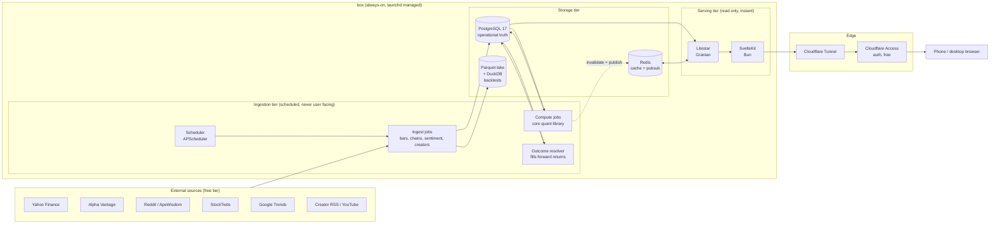
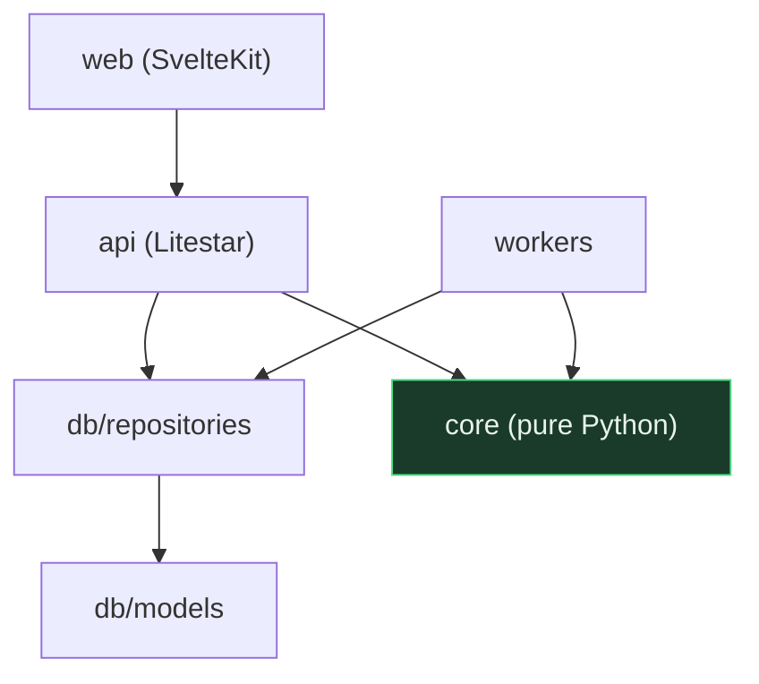
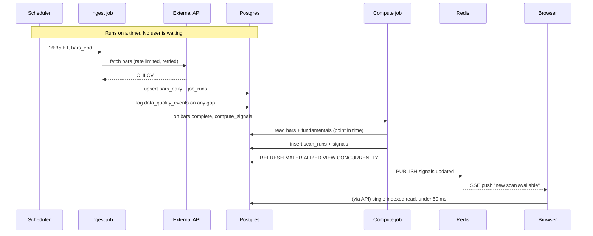
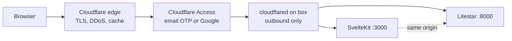
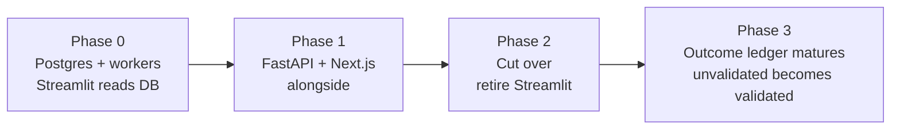

# CashFlow Trader v2: Architecture

**Status:** design, ready to implement
**Target host:** `box` (MacBook Pro M3 Pro, 11 cores, 18 GB RAM, macOS 26.5, always-on)
**Runtimes already installed there:** Python 3.12.13 / 3.13.14 / 3.14.6, Node 26.0.0, Homebrew 6
**Chosen runtimes:** Python 3.13 for services, Bun for web, PostgreSQL 17
**Author's note for the implementer:** every decision below has a stated reason and a stated
alternative that was rejected. If you disagree with a decision, change it deliberately and
update the reason. Do not change it by accident.

---

## 1. What we are building and why the current app is slow

The Streamlit app fetches data **while the user waits**. Every scan opens network calls to
Yahoo, Reddit, StockTwits and Google Trends inside the request path, then computes quant
scores, then paints. That is why it feels stuck: the user is paying, in real time, for work
that has nothing to do with their click.

**The single idea behind this whole document:**

> Reading is instant because nothing is computed during a read.
> Everything is computed ahead of time by background workers and written to a database.

x.com and fb.com feel fast for exactly this reason. They do not assemble your feed when you
ask for it. Neither will we.

### Goals

| Goal | Concrete target |
|---|---|
| Instant reads | API p95 under 50 ms, dashboard interactive under 1.5 s |
| Phone and desktop | One responsive web app, installable as a PWA |
| Data you can trend | Append-only history in SQL, queryable, never overwritten |
| Nothing blocks the user | All fetching happens on a schedule or in a queued job |
| Free | Self-hosted on `box`, cost is the domain only |
| Upgradeable | Swap any layer without touching the quant core |
| Honest quant | The outcome ledger the audit demanded, built in from day one |

### Non-goals

Multi-tenant SaaS, mobile native apps, sub-second market data, order execution. None of
these are needed and each would distort the design.

---

## 2. The shape of the system



**Read the diagram this way:** the left half runs on a timer and the user never sees it. The
right half only reads. There is no arrow from a browser to Yahoo. That absence is the design.

---

## 3. Stack decisions

Every row states what we picked, why, and what we rejected.

**Selection rule for this table: where two options are both correct, take the faster one.**
Speed was an explicit requirement, so these picks are benchmarked-fastest rather than
most-familiar. Section 3.1 states honestly where that costs you something.

| Layer | Choice | Why | Rejected |
|---|---|---|---|
| Operational DB | **PostgreSQL 17** | ACID, JSONB, partitioning, materialized views, mature. Data volume here is millions of rows, which is nothing for Postgres. | SQLite: excellent single-node but weaker under concurrent worker writes and no concurrent matview refresh. MongoDB: we have relational data with real joins. |
| DB driver | **asyncpg**, raw SQL in `db/repositories/` | The fastest Postgres driver for Python by a wide margin: binary protocol, prepared statement cache, roughly 3x psycopg on read throughput. An ORM in the hot path buys nothing here because our reads are two or three hand-tuned queries. | SQLAlchemy ORM at runtime: object hydration overhead on every row for no benefit. It stays for migrations only. |
| Analytics / backtest | **Parquet lake + DuckDB** | Columnar scans over years of bars are the one workload a row store is mediocre at. DuckDB reads Parquet at memory speed, runs in-process, zero server, and is vectorised. This is what modern quant desks actually use. | Timescale: good, but an extension dependency for a benefit DuckDB gives free. Everything-in-pandas: does not scale and is part of why the current app is slow. |
| Cache / pubsub | **Redis 8** | Sub-millisecond reads and pub/sub for live UI push. Optional by design: if Redis is down the API reads Postgres directly and stays correct, just slower. | Postgres LISTEN/NOTIFY only: workable, but Redis also solves caching in the same process boundary. |
| API framework | **Litestar** on **Python 3.13** | Benchmarks consistently ahead of FastAPI on request throughput, and it uses **msgspec** rather than Pydantic for serialisation, which is the fastest validation/serialisation library in Python. Same async model, better dependency injection, and it still **reuses `core/` unchanged**. Python 3.13 is measurably faster than 3.12 and is already installed on the box. | FastAPI: fine, and the safe fallback if the team stalls; simply slower per request. Node or Go API: would strand 852 tests of hardened quant code behind a language boundary. |
| HTTP server | **Granian** | A Rust HTTP server for Python ASGI. Faster than uvicorn, lower tail latency, and handles its own worker supervision. | uvicorn + httptools: the conventional pick, measurably slower under concurrency. Keep as fallback. |
| Serialisation | **msgspec** | Fastest JSON encode/decode in Python, and it validates while decoding so there is no second pass. | Pydantic v2: fast, but msgspec is faster and Litestar is built around it. orjson: encode only, no validation. |
| Job scheduling | **APScheduler** in a dedicated worker process | Cron-like schedules in-process, simple, no broker required for the periodic path. | Celery: more machinery than a single box needs. Bare cron: no retry, no job state, no introspection. |
| On-demand jobs | **Arq** (async Redis queue) | For user-triggered work like "build a dossier for TSLA": enqueue, return immediately, stream progress. Keeps the request path clean. | Running it inline: that is the current bug. |
| Frontend | **SvelteKit + Svelte 5 (runes)**, TypeScript, Tailwind v4, shadcn-svelte | The faster choice, and not marginally: Svelte compiles away the framework, so there is no virtual DOM diff at runtime and hydration payloads are typically 30 to 50 percent smaller than the React equivalent. For a data-dense dashboard that is exactly the workload where it wins. | Next.js 15 + React 19: bigger runtime, heavier hydration. My earlier objection was charting ecosystem, and it was wrong: the two chart libraries below are vanilla JS and framework agnostic, so React buys nothing here. |
| JS runtime | **Bun** | Faster cold start, faster install, faster server-side IO than Node. SvelteKit has a first-class Bun adapter. Node 26 is already on the box as the fallback if any dependency misbehaves. | Node: the safe default, simply slower to boot and to serve. |
| Data fetching | **TanStack Query (Svelte)** | Caching, background refetch, stale-while-revalidate and optimistic updates are solved problems. Do not hand-roll. | Raw fetch in effects: reinvents caching badly. |
| Price charts | **TradingView lightweight-charts** | Canvas-based, built for exactly this, handles tens of thousands of candles at 60 fps. It is the library real trading UIs use. Free, Apache 2.0. | Recharts/Chart.js for candles: SVG DOM nodes per bar, dies past a few thousand points. |
| Dense series | **uPlot** | The fastest time-series renderer in JS by a wide margin. Use for sparklines and any chart with many points. | Same as above. |
| Analytics charts | **LayerChart** (D3 under Svelte) or hand-rolled D3 | Composable primitives for heatmaps, distributions, scatter. D3 scales/shapes are framework agnostic; only the rendering is Svelte. | ECharts: capable but a large bundle and its own mental model. visx: React only. |
| Realtime | **Server-Sent Events** | One-directional push is all we need. Simpler than WebSockets, auto-reconnects, passes cleanly through Cloudflare Tunnel. | WebSockets: adopt only if the UI ever needs to send high-frequency messages upstream. |
| Exposure | **Cloudflare Tunnel** | Outbound-only connection, no open router ports, home IP never exposed, free TLS, DDoS protection, works behind CGNAT. | Port forwarding + DDNS: exposes your home IP and depends on ISP behaviour. ngrok free: URL churn. |
| Auth | **Cloudflare Access** (free up to 50 users) | Zero-trust auth **in front of** the app. You write no login code, store no passwords, and the app never sees an unauthenticated request. This is both the easiest and the most secure option. | Rolling your own auth: needless risk for a personal tool holding position data. |
| Process supervision | **launchd** plists | `box` already runs 16 launchd agents with watchdogs and backups. Match the pattern that already works there. | Docker Compose: on macOS every container runs in a VM, costing memory and IO for no gain on a single-tenant box. |
| Migrations | **Alembic** | Versioned, reversible schema changes. Non-negotiable for a database you intend to keep for years. | Hand-written SQL applied by hand: guarantees drift. |

### 3.1 What the fast picks cost you, honestly

Choosing fastest over most-common is not free, and you should know the bill before you pay it:

- **Litestar and Granian have smaller communities than FastAPI and uvicorn.** Fewer Stack
  Overflow answers, fewer blog posts. Both are mature and well documented, but if the
  implementation stalls on an obscure issue, **falling back to FastAPI + uvicorn is a
  contained change**: same ASGI interface, same async model, same `core/` underneath. Budget
  for that possibility rather than fearing it.
- **Svelte has fewer prebuilt components than React.** `shadcn-svelte` covers the common
  primitives, but if you need an exotic widget you may build it. For a four-route dashboard
  this is a small surface.
- **Bun occasionally trips on a native dependency.** Node 26 is already installed as the
  escape hatch; switching is one line in the adapter config.

### 3.2 The honest caveat about all of it

For a single user on an M3 Pro, **none of these framework choices will be the bottleneck.**
The read/write split in section 2 is worth more than every other decision in this table
combined: it turns a multi-second wait into a single indexed read. The fast stack is chosen
because it is free to choose it now and expensive to change later, not because Litestar
versus FastAPI is what you will feel. **Do not let stack debates delay Phase 0.**

### 3.3 Postgres tuning for this box (18 GB RAM)

Defaults assume a shared server and leave most of the machine unused. Set in `postgresql.conf`:

```conf
shared_buffers = 4GB              # ~25% of RAM
effective_cache_size = 12GB       # what the planner assumes the OS caches
work_mem = 64MB                   # per sort/hash node; we run few concurrent queries
maintenance_work_mem = 1GB        # faster index builds and matview refresh
random_page_cost = 1.1            # NVMe, not a spinning disk
effective_io_concurrency = 200
max_worker_processes = 11
max_parallel_workers = 8
max_parallel_workers_per_gather = 4
wal_compression = zstd
checkpoint_completion_target = 0.9
```

`random_page_cost = 1.1` matters more than it looks: with the default of 4.0 the planner
assumes spinning disks and avoids index scans it should be using.

---

## 4. Repository layout

The most important structural rule in this document:

> **`core/` has zero framework dependencies.** No Streamlit, no Litestar, no database driver.
> It is a pure library of quant functions over dataframes and plain types.

That single rule is what makes everything above swappable, and it is what lets the 852
existing tests keep passing while everything around them changes.

```
cashflow-trader/
  core/                     # the current modules/, minus all Streamlit
    asymmetry.py            #   convexity, EV, skewed Kelly, base rates
    options.py              #   Black-Scholes, greeks, GEX, Monte Carlo
    ta.py                   #   indicators, regime
    validated_signals.py    #   promotion_gate, the discipline layer
    creator_signals.py
    sentiment_radar.py
    find10x.py              #   ranking logic only, no rendering
    explain.py              #   the 66-term plain-English registry
  db/
    migrations/             # Alembic
    models.py               # SQLAlchemy 2.0 typed models
    repositories/           # query functions, the ONLY place SQL lives
  workers/
    scheduler.py            # APScheduler entrypoint
    jobs/
      ingest_bars.py
      ingest_options.py
      ingest_sentiment.py
      ingest_creators.py
      compute_signals.py
      resolve_outcomes.py   # the Stage 2 ledger
      refresh_views.py
    lake.py                 # Parquet writer, DuckDB query helpers
  api/
    main.py                 # Litestar app (Granian entrypoint)
    routers/                # one file per resource
    schemas/                # msgspec.Struct response models
    deps.py                 # DI: db session, cache, auth context
  web/                      # SvelteKit (Svelte 5 runes, Bun)
    app/
    components/
    lib/
  ops/
    launchd/                # *.plist for api, worker, cloudflared
    cloudflared/            # tunnel config
    README.md               # runbook
  legacy_streamlit/         # current app.py + modules, kept until cutover
  tests/                    # the existing 852, plus new layers
```

### The dependency rule, enforced



Arrows only point downward. `core/` imports nothing from the layers above it. Add a CI check
that fails the build if `core/` ever imports `litestar`, `asyncpg`, `sqlalchemy`, `streamlit` or `redis`.

---

## 5. Data model

This is the part that makes "trends and easy to pull" true, and it is simultaneously the
audit's Stage 2 outcome ledger. Those turned out to be the same requirement.

### Two principles that prevent the audit's worst finding

1. **Append-only.** Never `UPDATE` a signal row. Insert a new one. History is the product.
2. **Bitemporal.** Every fact carries both `as_of` (when it was true in the market) and
   `ingested_at` (when we learned it). Point-in-time correctness is then a `WHERE` clause
   instead of a hope. **This structurally kills lookahead bias**, which was audit finding #4.

### Core tables

```sql
-- Ticker registry -----------------------------------------------------------
CREATE TABLE instruments (
  symbol            text PRIMARY KEY,
  name              text,
  exchange          text,
  sector            text,
  industry          text,
  is_active         boolean NOT NULL DEFAULT true,
  first_seen        date,
  created_at        timestamptz NOT NULL DEFAULT now()
);

-- Daily bars. Partition by year; BRIN index because inserts are time-ordered.
CREATE TABLE bars_daily (
  symbol            text NOT NULL REFERENCES instruments(symbol),
  as_of             date NOT NULL,
  open              numeric(18,6) NOT NULL,
  high              numeric(18,6) NOT NULL,
  low               numeric(18,6) NOT NULL,
  close             numeric(18,6) NOT NULL,
  volume            bigint,
  price_basis       text NOT NULL CHECK (price_basis IN ('adjusted','unadjusted')),
  source            text NOT NULL,               -- 'yahoo' | 'alphavantage'
  ingested_at       timestamptz NOT NULL DEFAULT now(),
  PRIMARY KEY (symbol, as_of, price_basis)
) PARTITION BY RANGE (as_of);

CREATE INDEX ON bars_daily USING brin (as_of);
```

> `price_basis` is not decoration. Audit finding #8 was that the Alpha Vantage fallback
> silently mixed split-unadjusted prices into an adjusted series, injecting a fake gap at
> every reverse split. Carrying the basis in the primary key makes that mistake
> **impossible to represent** rather than merely unlikely.

```sql
-- Point-in-time fundamentals. Never overwritten; a new snapshot is a new row.
CREATE TABLE fundamentals_snapshot (
  symbol            text NOT NULL REFERENCES instruments(symbol),
  as_of             date NOT NULL,
  market_cap        numeric,
  float_shares      numeric,
  short_interest_pct numeric,
  revenue_ttm       numeric,
  gross_margin      numeric,
  fcf_ttm           numeric,
  enterprise_value  numeric,
  payload           jsonb NOT NULL,              -- full raw response
  source            text NOT NULL,
  ingested_at       timestamptz NOT NULL DEFAULT now(),
  PRIMARY KEY (symbol, as_of, source)
);

-- Options chains, one row per contract per snapshot.
CREATE TABLE options_snapshot (
  symbol            text NOT NULL,
  as_of             timestamptz NOT NULL,
  expiry            date NOT NULL,
  strike            numeric(18,6) NOT NULL,
  right             char(1) NOT NULL CHECK (right IN ('C','P')),
  bid               numeric, ask numeric, last numeric,
  volume            bigint, open_interest bigint,
  implied_vol       numeric,
  PRIMARY KEY (symbol, as_of, expiry, strike, right)
) PARTITION BY RANGE (as_of);

-- Attention, stored over time so you can chart the cascade.
CREATE TABLE sentiment_snapshot (
  symbol            text NOT NULL,
  as_of             timestamptz NOT NULL,
  score             numeric,
  velocity          numeric,
  wilson            numeric,
  volume_z          numeric,
  trends_ratio      numeric,
  mentions          integer,
  stage             text,
  flags             text[] NOT NULL DEFAULT '{}',
  PRIMARY KEY (symbol, as_of)
);

CREATE TABLE creator_mentions (
  id                bigserial PRIMARY KEY,
  symbol            text NOT NULL,
  source_id         text NOT NULL,
  source_name       text,
  published_at      timestamptz,
  direction         text,                        -- bullish | bearish | NULL
  tier              text NOT NULL,               -- cashtag | bare
  title             text,
  url               text,
  ingested_at       timestamptz NOT NULL DEFAULT now(),
  UNIQUE (source_id, url, symbol)
);
```

### The signal and outcome ledger (the important part)

```sql
-- Every execution of a scan, successful or not.
CREATE TABLE scan_runs (
  id                bigserial PRIMARY KEY,
  kind              text NOT NULL,               -- 'find10x' | 'radar' | 'diamonds'
  universe          text[] NOT NULL,
  config_hash       text NOT NULL,               -- hash of thresholds/weights used
  code_version      text NOT NULL,               -- git sha
  started_at        timestamptz NOT NULL,
  finished_at       timestamptz,
  status            text NOT NULL,               -- running | ok | partial | failed
  error             text
);

-- Every signal ever fired. Append only.
CREATE TABLE signals (
  id                bigserial PRIMARY KEY,
  run_id            bigint NOT NULL REFERENCES scan_runs(id),
  symbol            text NOT NULL,
  as_of             timestamptz NOT NULL,
  signal_type       text NOT NULL,               -- 'find10x' | 'blue_diamond' | 'swing_pullback'
  score             numeric,
  confidence        numeric,
  convexity_ratio   numeric,
  entry             numeric, stop numeric, target numeric,
  flags             text[] NOT NULL DEFAULT '{}',
  payload           jsonb NOT NULL,              -- full explainable breakdown
  UNIQUE (run_id, symbol, signal_type)
);
CREATE INDEX ON signals (symbol, as_of DESC);
CREATE INDEX ON signals (signal_type, as_of DESC);

-- STAGE 2. This table is what turns "unvalidated" into a real claim.
CREATE TABLE signal_outcomes (
  signal_id         bigint NOT NULL REFERENCES signals(id),
  horizon_days      integer NOT NULL,            -- 5, 21, 63, 252
  forward_return    numeric,                     -- close-to-close
  max_gain          numeric,                     -- best excursion in window
  max_drawdown      numeric,                     -- worst excursion in window
  hit_2x            boolean,
  hit_5x            boolean,
  hit_10x           boolean,
  resolved_at       timestamptz NOT NULL DEFAULT now(),
  PRIMARY KEY (signal_id, horizon_days)
);
```

> **Why this table is the whole point.** Every row in the Find 10x tab currently reads
> `unvalidated`, and honestly so, because nothing has been measured against what actually
> happened next. `signal_outcomes` is the measurement. Once it has n >= 100 matured signals,
> `core.validated_signals.promotion_gate` can be run over it, and a screen either earns the
> word `validated` or it does not. No other feature in this document matters as much.

```sql
-- Positions and journal, replacing trade_journal.json.
CREATE TABLE positions (
  id                bigserial PRIMARY KEY,
  symbol            text NOT NULL,
  kind              text NOT NULL,               -- equity | call | put | spread
  opened_at         timestamptz NOT NULL,
  closed_at         timestamptz,
  quantity          numeric NOT NULL,
  entry_price       numeric NOT NULL,
  exit_price        numeric,
  strike            numeric, expiry date,
  premium_per_share numeric,                     -- options
  close_convention  text,                        -- 'buyback' | 'expiry'  (audit #3)
  realized_pnl      numeric,
  signal_id         bigint REFERENCES signals(id),   -- did a signal cause this trade?
  notes             text
);

-- Operational logs. This is the "logs" you asked for.
CREATE TABLE job_runs (
  id                bigserial PRIMARY KEY,
  job_name          text NOT NULL,
  started_at        timestamptz NOT NULL,
  finished_at       timestamptz,
  status            text NOT NULL,               -- ok | partial | failed
  rows_written      integer,
  duration_ms       integer,
  error             text,
  detail            jsonb
);
CREATE INDEX ON job_runs (job_name, started_at DESC);

-- The honesty layer, carried forward from the audit.
CREATE TABLE data_quality_events (
  id                bigserial PRIMARY KEY,
  occurred_at       timestamptz NOT NULL DEFAULT now(),
  symbol            text,
  source            text NOT NULL,
  kind              text NOT NULL,   -- partial-data | source-disagreement | stale | unadjusted-fallback
  detail            jsonb
);
```

`close_convention` on `positions` exists because audit finding #3 was a realized P&L formula
that assumed expiry intrinsic while the input was labelled "Close price", turning a +$230
result into a recorded -$2,530. Storing which convention was used makes the number
reconstructable forever.

### Materialized views: where the speed comes from

```sql
CREATE MATERIALIZED VIEW mv_dashboard_latest AS
SELECT DISTINCT ON (s.symbol, s.signal_type)
       s.symbol, s.signal_type, s.score, s.confidence, s.convexity_ratio,
       s.entry, s.stop, s.target, s.flags, s.payload, s.as_of,
       i.name, i.sector, f.market_cap, f.float_shares, f.short_interest_pct
FROM signals s
JOIN instruments i USING (symbol)
LEFT JOIN LATERAL (
  SELECT * FROM fundamentals_snapshot fs
  WHERE fs.symbol = s.symbol AND fs.as_of <= s.as_of::date
  ORDER BY fs.as_of DESC LIMIT 1
) f ON true
ORDER BY s.symbol, s.signal_type, s.as_of DESC;

CREATE UNIQUE INDEX ON mv_dashboard_latest (symbol, signal_type);
-- Refreshed by workers.jobs.refresh_views after each compute pass:
--   REFRESH MATERIALIZED VIEW CONCURRENTLY mv_dashboard_latest;
```

The dashboard endpoint is then literally `SELECT * FROM mv_dashboard_latest ORDER BY score
DESC LIMIT 50`. That is a single indexed read. **That is how you get x.com speed.**

---

## 6. Ingestion and scheduling



### Schedule

| Job | Cadence | Notes |
|---|---|---|
| `ingest_bars` | 16:35 ET weekdays, plus 06:00 backfill | Batch download, respects rate limits |
| `ingest_fundamentals` | Weekly, Sunday | Slow-moving data |
| `ingest_options` | Every 15 min during market hours, watchlist only | The expensive one, keep the universe small |
| `ingest_sentiment` | Every 15 min | Free APIs rate-limit hard, back off on 429 |
| `ingest_creators` | Every 30 min | RSS is cheap |
| `compute_signals` | Chained after `ingest_bars`, and every 30 min intraday | Runs `core/` over fresh data |
| `resolve_outcomes` | Daily 17:00 ET | Fills `signal_outcomes` for matured horizons |
| `refresh_views` | After every compute | `CONCURRENTLY`, never blocks readers |
| `vacuum_and_lake` | Nightly | Roll closed partitions to Parquet |

### Rules every job must follow

1. Write a `job_runs` row on start and on finish, always, including failures.
2. Never raise into the scheduler. Catch, log, record `status='failed'`, continue.
3. Rate limit and back off. A 429 is a scheduling problem, not an error to retry immediately.
4. **Never invent data.** A failed source writes a `data_quality_events` row and leaves the
   field NULL. This is the discipline the audit found the app already claimed and sometimes
   broke; here it is enforced by NOT NULL being absent rather than by convention.
5. Idempotent. Re-running a job for the same `as_of` must converge, not duplicate.

---

## 7. API design

Litestar on Granian, all responses typed as `msgspec.Struct`, all reads served from Postgres
or Redis. Handlers are async; the CPU-bound quant core runs in a process pool so a heavy
computation can never block the event loop.

```
GET  /api/health                          liveness + last successful job per pipeline
GET  /api/dashboard                       top ranked opportunities  (mv read)
GET  /api/tickers/{symbol}                one instrument, full card
GET  /api/tickers/{symbol}/bars           OHLCV, range + interval params
GET  /api/tickers/{symbol}/signals        signal history for charting the trend
GET  /api/tickers/{symbol}/sentiment      attention time series
GET  /api/signals                         filter by type, score, date range
GET  /api/signals/{id}/explain            the full breakdown behind one score
GET  /api/validation                      base rates, precision/recall, promotion_gate status
GET  /api/positions                       journal
POST /api/positions                       open
PATCH /api/positions/{id}                 close (requires close_convention)
POST /api/jobs/dossier                    enqueue; returns job id immediately
GET  /api/jobs/{id}                       poll status
GET  /api/events                          SSE stream: scan complete, job done
GET  /api/ops/jobs                        job_runs, for the status page
GET  /api/ops/data-quality                recent data_quality_events
```

**Hard rule:** no endpoint may call an external API. If an endpoint needs data that is not in
the database, the correct response is a 202 with a queued job id, or a documented empty state.
Violating this rule reintroduces the exact problem we are solving.

Conventions: cursor pagination, `ETag` + `If-None-Match`, `Cache-Control` on read endpoints,
`X-Request-Id` on everything, msgspec encoding throughout, and Brotli left to the Cloudflare
edge rather than burned on the box.

---

## 8. Frontend

### Information architecture

The UI audit found 11 landable tab surfaces and 308 formatted numbers, with the worst screen
showing 85. That is the thing to fix, and the rewrite is the opportunity.

**Four routes. Each answers one question in its title.**

| Route | The question it answers |
|---|---|
| `/` **Today** | What is worth my attention right now? |
| `/ticker/[symbol]` **One name** | Everything about this one stock, progressively disclosed |
| `/positions` **Mine** | What am I holding and how is it doing? |
| `/validation` **Proof** | Does any of this actually work? |

Plus `/ops` for job health, linked from the footer, not the nav.

### Rules that keep it fast and legible

1. **One verdict sentence per card, always visible.** Plain English, no jargon. The math goes
   behind a disclosure. Reuse `core/explain.py`, which already holds 66 terms with a plain
   sentence, a real explanation and the formula this codebase actually uses.
2. **No screen shows more than 9 numbers without a disclosure.**
3. **Skeletons, never spinners,** for anything over 200 ms. Layout must not shift.
4. **Server-load data by default.** SvelteKit `load` functions fetch on the server so the
   first paint carries real data; client-side stores only where interactivity demands it.
5. **Route-level code splitting.** Charts are dynamically imported; lightweight-charts never
   enters the initial bundle. Svelte already ships no framework runtime to diff, so the
   remaining budget is almost entirely your own code.
6. **Optimistic updates** on journal actions through TanStack Query for Svelte.

### Performance budget, enforced in CI with Lighthouse

| Metric | Budget |
|---|---|
| Largest Contentful Paint | < 1.2 s |
| Interaction to Next Paint | < 200 ms |
| Cumulative Layout Shift | < 0.05 |
| Initial JS (gzipped) | < 120 kB (Svelte makes this comfortable; React would have needed 180) |
| API p95 | < 50 ms |

---

## 9. Charts and quant presentation

This is where "best of the best" is earned or lost.

| Chart | Library | Why |
|---|---|---|
| Candles, volume, overlays, markers | lightweight-charts | 60 fps at tens of thousands of bars |
| Sparklines, dense series | uPlot | Fastest renderer available |
| Payoff diagrams, distributions, heatmaps | visx | Composable, exact control |
| Signal history over time | lightweight-charts markers | Put signals on the price they fired at |

### Charting rules taken directly from the audit

The audit found phantom diamond markers drawn when no signal existed, Fibonacci labels
transposed on down-swings, green support rails drawn above spot, and an "IV Crush"
annotation that plotted realized vol. Those were not rendering bugs so much as missing rules.
Encode the rules:

1. **A marker may only exist where a signal exists.** Empty series, not a placeholder glyph.
2. **What is labelled is what is plotted.** If the series is realized vol, the label says
   realized vol.
3. **Never truncate a price y-axis** without an explicit visual break.
4. **Support renders below spot, resistance above.** Filter by side, not by absolute distance.
5. **Colour is never the only signal.** Pair every colour with a shape or a label, for
   colour-vision accessibility and for screenshots.
6. **Every chart states its as-of time and its source.** Stale data is labelled stale.

### Quant surface

The quant work already in `core/` is the differentiator, so surface it honestly:

- **Rank by expected value and convexity, never by summed points.** `core/asymmetry.py`
  already implements `expected_value`, `convexity_score`, `iv_rank`, `coiled_spring_score`,
  `catalyst_window` and the exact two-point `kelly_fraction_skewed`.
- **Show the payoff shape, not just a number.** Every opportunity card carries a small payoff
  diagram: bounded downside to support, target from ATR expansion.
- **Show the base rate next to every claim.** `/validation` is a first-class route precisely
  so the honest answer is one click away, not buried.
- **Sizing uses `kelly_fraction_skewed` with the fractional haircut,** and displays the
  fraction of bankroll, capped. Never surface a short-premium Kelly on a long-equity row;
  that was audit finding #1 and it could print over 100% of bankroll.

> The thing that separates a million dollar quant platform from a pretty dashboard is not more
> indicators. It is the outcome ledger, the point-in-time discipline, and the willingness to
> print "unvalidated" when that is the truth. This architecture builds all three in from day
> one. Resist every temptation to add a twelfth indicator before `/validation` has real n.

---

## 10. Exposure, auth and deployment

### Domain

Use **`sprucespark.com`** for the app and keep the other two parked. Suggested:

- `trade.sprucespark.com` the app
- `api.sprucespark.com` the API, or keep it same-origin under `/api` (simpler, no CORS)

**Same-origin is recommended:** one hostname, no CORS, no preflight latency.

**One prerequisite:** Cloudflare Tunnel requires the domain's DNS to be on Cloudflare. At
GoDaddy you change the nameservers to Cloudflare's, which is free and takes a few minutes to
propagate. Registration stays at GoDaddy; only DNS moves.

### The edge chain



No inbound ports are opened on the router. `box` keeps its current posture: the new services
bind `127.0.0.1` only, and the tunnel is the only path in.

### launchd services to add

Match the existing naming convention on the box (`ai.*`, `com.hasroon.*`):

| Label | Runs |
|---|---|
| `com.hasroon.cft.api` | Granian serving Litestar on 127.0.0.1:8000 |
| `com.hasroon.cft.web` | Bun serving SvelteKit on 127.0.0.1:3000 |
| `com.hasroon.cft.worker` | APScheduler + Arq worker |
| `com.hasroon.cft.tunnel` | cloudflared |

All with `KeepAlive`, `RunAtLoad`, and stdout/stderr to `~/Library/Logs/cashflow/`. Add each
to uptime-kuma, which is already running on `:3001`.

---

## 11. Observability

You already run uptime-kuma. Add:

- **structlog** JSON logs to `~/Library/Logs/cashflow/`, rotated by `newsyslog`.
- **`/api/health`** reports the last successful run per pipeline, not just process liveness.
  A process that is up while ingestion has been failing for six hours is not healthy.
- **`/ops`** page reading `job_runs` and `data_quality_events`. When a number looks wrong,
  this is where you find out that Yahoo returned nothing at 16:35.
- Point uptime-kuma at `/api/health` and let it alert.

---

## 12. Migration plan

Incremental. Streamlit keeps working the entire time. There is never a big-bang cutover.



**Phase 0 is the one that pays immediately.** Stand up Postgres and the ingest workers, then
change the existing Streamlit app to read from the database instead of fetching. The current
UI instantly stops blocking on network calls. This is a small change with most of the
perceived speed win, and it de-risks everything after it.

**Phase 3 is the one that matters.** Nothing before it entitles the app to claim an edge.

---

## 13. Upgrade seams

Places deliberately designed so a future change is cheap:

| If you later want | Change only |
|---|---|
| A different database | `db/repositories/` (the only place SQL lives) |
| A hosted deploy instead of `box` | `ops/` plists become a Dockerfile; nothing else moves |
| A native mobile app | It consumes the same `/api`; the web app is just one client |
| Real-time streaming quotes | Add a websocket ingest worker; the read path is unchanged |
| Multi-user | Add `user_id` columns and a Cloudflare Access identity claim; the core is already stateless |
| A different frontend framework | `web/` is replaceable wholesale; the API contract is the boundary. The chart libraries are vanilla JS and move with you. |
| Different quant models | `core/` only, with the existing test suite as the guard |

---

## 14. Build order for the implementer

Do these in order. Each step ends with something that works.

1. **`db/`**: Alembic + the schema in section 5. Seed `instruments` from the current
   watchlist and radar universe. Ship migrations before any code depends on them.
2. **`core/`**: move `modules/` to `core/`, strip every Streamlit import, add the CI check
   that forbids framework imports. **All 852 tests must still pass, on Python 3.13 as well as
   3.12.** They were validated on 3.12.13; run them on 3.13 before committing to it, and if
   anything fails, fix it there rather than downgrading. This is the safety net; do not
   proceed until it is green on both.
3. **`workers/ingest_bars`** plus `job_runs` logging. Backfill two years for the universe.
   Verify `price_basis` is populated correctly for both sources.
4. **`workers/compute_signals`** writing `scan_runs` and `signals` using `core/`.
5. **`workers/resolve_outcomes`** and the matviews. Backfill outcomes over the historical
   bars you just loaded, which gives `/validation` real n on day one rather than in a year.
6. **`api/`**: health, dashboard, ticker, signals, validation. Contract-test every endpoint.
7. **`web/`**: `/` and `/ticker/[symbol]` first, with lightweight-charts and `explain.py`
   glosses wired through.
8. **`ops/`**: launchd plists, cloudflared, Cloudflare Access, uptime-kuma checks.
9. **`/positions` and `/validation`**, then retire Streamlit.

**Definition of done for each step:** tests pass, the job appears in `/ops`, and the failure
mode is visible rather than silent.

---

## 15. The rule that matters most

Every layer here can be replaced. Postgres could become something else, Next.js could become
something else, the box could become a VPS. One thing must not change:

> A number shown to the user is either measured, or labelled as not measured.
> Never a plausible-looking default.

That rule is the difference between a trading tool and a toy, and it is the one the audit
found broken in the most places: fabricated VIX values presented as live, a Kelly fraction
that could exceed the whole account, win rates contaminated by lookahead, and a score called
"10x Potential" that contained no payoff term at all. Build the new system so those failures
are not merely fixed but unrepresentable.
